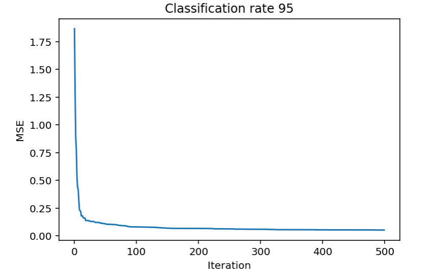

# PSOGSA
FNN optimisation using PSOGSA algorithm

The program ran for 500 iterations. The number of particles employed is 30. The neural network to be optimized is one layer with 15 hidden units. Dataset used for training is iris dataset.

The Mean Square Error after optimizing

Here is the link to the [paper](http://ieeexplore.ieee.org/stamp/stamp.jsp?arnumber=6141614)
